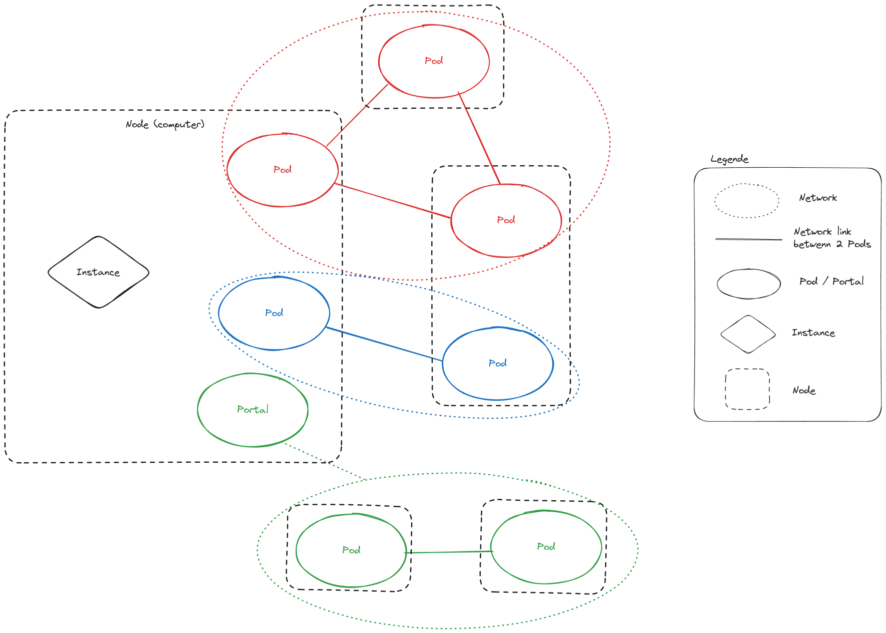

# Glossary
>
> [!NOTE]
> Most of the chosen concepts names are willingly the same as for Kubernetes concepts,
> thus facilitating learning if you're already familiar with distributed computing.

## Components

Simply put :
**Network > Node > Pod**

---

#### Network / Cluster

The whole set of worker machines (called **active pods**).

---

#### Wormhole

The name of the software and of its provided file system.
> [!NOTE]
> This term describe the "whole" process. Used a lot when addressing the tangible effects :
>
> - To mount a wormhole
> - A Wormhole folder

---

#### Node

A node is a worker machine running an **instance** of the WormHole service. 
A node can be part of many **networks** by hosting many **pods**.

---

#### Instance

The running process of WormHole on a **node**. 
There should be only one per **node**.
> [!NOTE]
> Generally speaking this term won't be often used as there should be only one **instance** per **node**.

---

#### Pod

The smallest part of the **cluster**. A **pod** is the part of a **node** dedicated to a **network**.
A **pod** has a mountpoint in the **node**'s filesystem.
> [!NOTE]
> A **node** can be part of many different **networks**. The **node** will host one **pod** for each.
> One **pod** is only referring to one **network**.

There is two types of **pods** :

- Active
    > A **pod** is said **active** when *part* of a network, participating to storage and subject to all rules of the network.
- Passive / Client
    > A **pod** is said **passive** when only aiming to allow the user/system to mount a wormhole. A **passive pod** is also names a **portal**
    >
> [!NOTE]
> An **active pod** join/leave operation is heavy. The **network** will acknowledge it and rebalance its strategy according to this new event.
>  
> A **passive pod** join/leave is weightless as it's only interracting with the network, not participating to the global strategy.
>

#### Portal

Portal is a futur type of **pod**, that have access to the files of the network but don't host any. It aims to open the possibilty of a Wormhole setup with servers storing the files and clients machines accessing the files.

