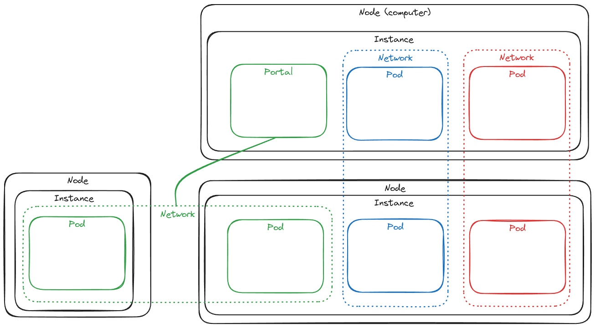

# Glossaire
>
> [!NOTE]
> La plupart des noms des concepts choisis sont volontairement les mêmes que ceux des concepts de Kubernetes,
> facilitant ainsi l'apprentissage si vous êtes déjà familier avec l'informatique distribuée.

## Composants

Pour faire simple :
**Réseau > Node > Pod**

---

#### Réseau / Cluster

L'ensemble des machines de travail (appelées **pods actifs**).

---

#### Wormhole

Le nom du logiciel et du système de fichiers fourni.
> [!NOTE]
> Ce terme décrit l'ensemble du processus. Il est souvent utilisé pour décrire les effets tangibles :
>
> - Pour monter Wormhole
> - Un dossier Wormhole
>
---

#### Nœud

Un nœud est une machine de travail qui exécute une **instance** du service WormHole. 
Un nœud peut faire partie de plusieurs **réseaux** en hébergeant plusieurs **podes**.

---

#### Instance

Processus en cours d'exécution de WormHole sur un **nœud**. 
Il ne doit y en avoir qu'un par **nœud**.
> [!NOTE]
> En général, ce terme ne sera pas souvent utilisé car il ne devrait y avoir qu'une **instance** par **nœud**.

---

#### Pod

La plus petite partie du **cluster**. Un **pod** est la partie d'un **nœud** dédiée à un **réseau**.
Un **pod** a un point de montage dans le système de fichiers du **nœud**.
> [!NOTE]
> Un **nœud** peut faire partie de plusieurs **réseaux** différents. Le **nœud** hébergera un **pod** pour chacun d'entre eux.
> Un **pod** ne se réfère qu'à un seul **réseau**.

Il existe deux types de **pods** :

- Actifs
    > Un **pod** est dit **actif** lorsqu'il fait *partie* d'un réseau, participe au stockage et est soumis à toutes les règles du réseau.
- Passif / Client
    > Un **pod** est dit **passif** lorsqu'il vise uniquement à permettre à l'utilisateur/système de monter un vortex. Un **pod** passif est aussi appelé **portail**
    >
> [!NOTE]
> Une opération d'entrée/sortie d'un pod **actif** est lourde. Le **réseau** en prendra acte et rééquilibrera sa stratégie en fonction de ce nouvel événement.
>  
> Une entrée/sortie **passive de pod** n'a pas de poids puisqu'elle ne fait qu'interagir avec le réseau et ne participe pas à la stratégie globale.
>

